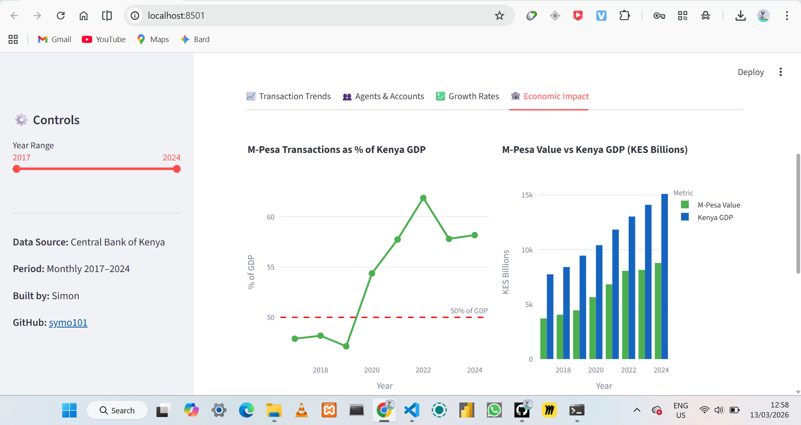
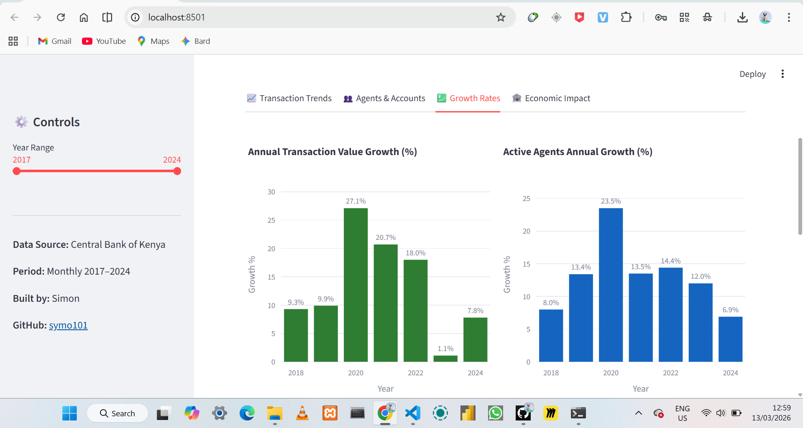

# M-Pesa Financial Dashboard

Interactive financial dashboard built from Central Bank of Kenya (CBK) official data, visualising M-Pesa transaction trends, agent growth, financial inclusion and economic impact from 2017 to 2024.

[](https://mpesa-financial-analysis-dashboard.streamlit.app/)

**Live App:** [mpesa-financial-analysis-dashboard.streamlit.app](https://mpesa-financial-analysis-dashboard.streamlit.app/)

---

## Screenshots






---

## Project Overview

This project uses official CBK mobile money statistics to build an interactive dashboard that tells the story of M-Pesa's growth in Kenya from 2017 to 2024.

The dataset covers 96 monthly data points across 8 years, tracking transaction value, transaction volume, active agents, registered accounts and Kenya's financial inclusion rate.

**Key Question:** How has M-Pesa transformed Kenya's financial landscape over the past 8 years?

---

## Project Structure

```
mpesa-financial-dashboard/
│
├── app.py              # Streamlit dashboard
├── mpesa_data.csv      # Monthly CBK dataset (96 rows)
├── requirements.txt    # Python dependencies
└── README.md
```

---

## Dataset

**File:** `mpesa_data.csv` — 96 rows, monthly from January 2017 to December 2024

| Column | Description |
|---|---|
| `date` | Month (YYYY-MM-01 format) |
| `year` | Year |
| `month` | Month number (1–12) |
| `transaction_value_kes_billions` | Total transaction value in KES billions |
| `transaction_volume_millions` | Number of transactions in millions |
| `active_agents` | Number of active M-Pesa agents |
| `registered_accounts_millions` | Registered M-Pesa accounts in millions |
| `financial_inclusion_pct` | Kenya financial inclusion rate (%) |

**Source:** Central Bank of Kenya (CBK) — National Payments System reports and annual mobile money statistics.

---

## Dashboard Features

The dashboard has 4 tabs and a year range slider in the sidebar:

**Transaction Trends**
Monthly transaction value line chart with COVID-19 period highlighted, monthly volume chart and annual value bar chart.

**Agents and Accounts**
Area charts showing agent network growth and registered account growth over time, plus financial inclusion rate by year.

**Growth Rates**
Year-on-year growth bars for transaction value and active agents, plus a monthly heatmap showing seasonal patterns across all 8 years.

**Economic Impact**
M-Pesa transactions as a percentage of Kenya GDP, comparison of M-Pesa value vs total GDP and key economic metrics.

---

## Key Findings

| Metric | Value |
|---|---|
| Total transaction value (2024) | KES 8,697 billion |
| Total transactions (2024) | 2,680 million |
| Active agents (2024) | 381,116 |
| Financial inclusion (2024) | 85% |
| M-Pesa as % of GDP (2024) | 57.6% |

1. M-Pesa transaction value grew by **139% from 2017 to 2024** — from KES 3,634B to KES 8,697B
2. **2020 saw the largest single-year jump (+19.5%)** driven by CBK's COVID-19 emergency policy waiving mobile money transfer fees
3. Financial inclusion rose from **75.3% in 2017 to 85% in 2024** — M-Pesa is the primary driver
4. December is consistently the highest transaction month each year due to festive season spending
5. In 2024, M-Pesa transactions equalled **57.6% of Kenya's GDP** — one of the highest ratios for mobile money anywhere in the world

---

## Run Locally

```bash
# 1. Clone the repo
git clone https://github.com/symo101/mpesa-financial-analysis-dashboard.git
cd mpesa-financial-analysis-dashboard

# 2. Install dependencies
pip install -r requirements.txt

# 3. Run the dashboard
streamlit run app.py
```

App opens at `http://localhost:8501`

---

## Tech Stack

| Tool | Purpose |
|---|---|
| `pandas` + `numpy` | Data manipulation |
| `plotly` | Interactive charts |
| `streamlit` | Web app and deployment |

---

## Requirements

```
pandas
numpy
plotly
streamlit==1.32.0
altair==5.2.0
```

---

## Author

**Simon**
- GitHub: [github.com/symo101](https://github.com/symo101)
- Live App: [mpesa-financial-analysis-dashboard.streamlit.app](https://mpesa-financial-analysis-dashboard.streamlit.app/)

---

*Data sourced from Central Bank of Kenya (CBK) official publications. Used for educational and portfolio purposes.*
